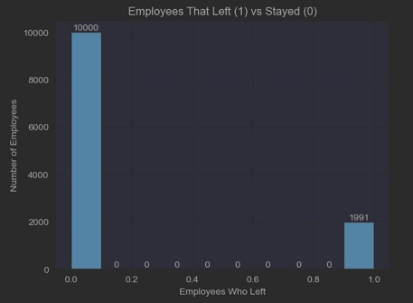
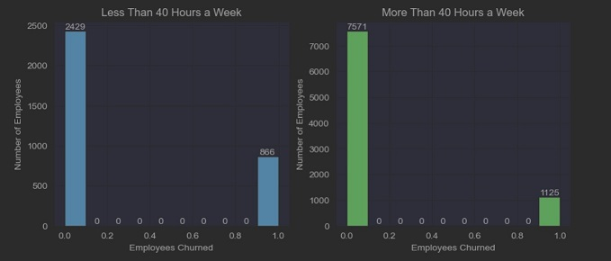
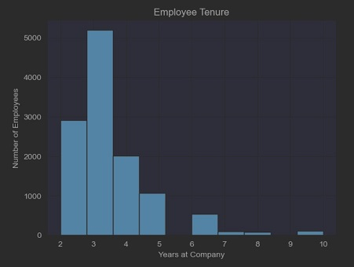
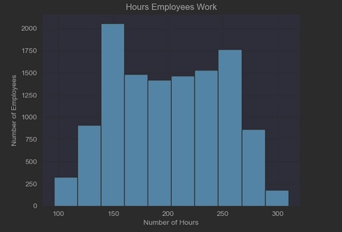
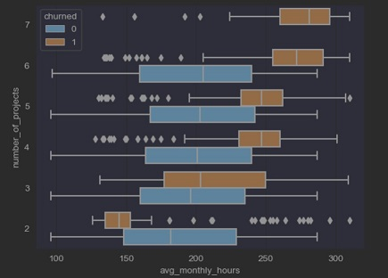
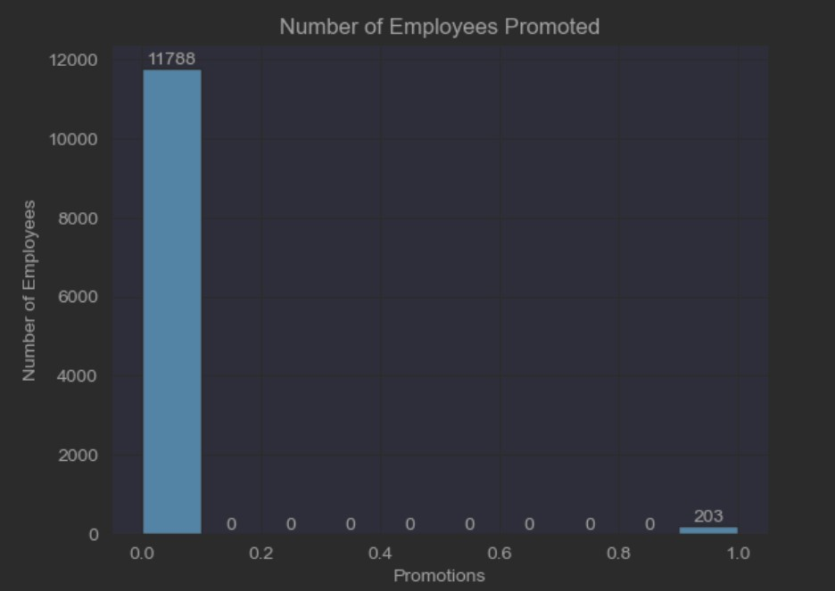

# Predicting Employee Churn For Salifort Motors

## Overview
Salifort Motors currently has a high turnover rate among employees and is concerned because they make a big investment in recruiting, training and upskilling it's employees.
Salifort Motors is seeking a method to use employee data to gauge what makes them leave the company and their reasons behind their departure. The method used to solve thier issue is a predictive model that can classify whether or not an employee will leave. For this task, I chose to build and evaluate two different models, a Logistic Regression Classifier and a Random Forest Classifier. I then compared the two based on their performace and transparency, to allow Salifort Motors to choose the best model for their needs. While the Logistic model exemplifies the most transparent model, the Random Forest Classifier performed the best. Here is a breakdown of how the two best tuned models performed:

| Metrics   | Logistic Regression | Random Forest |
|:----------|:--------------------|:--------------|
| Accuracy  | 87%                 |   99%         |
| Precision | 84%                 |   98%         |
| Recall    | 93%                 |   99%         |
| F1        | 88%                 |   99%         |
| AUC       | 87%                 |   99%         |

Based on the Random Forest model, satisfaction level, tenure, and the hours worked were the most influential features when determining if an employee was going to quit.

## Business Understanding

## Data Understanding
The dataset was provided by Salifort Motors and comprised of 14,999 self-reported employee surveys. The features included, satisfaction levels, evaluations, number of project contributions, average monthly hours worked, tenure at the company, work accidents, promotions, departments, salaries and if the employee left. After through analysis of the data, it was found that a number of these features had the potential influence behind an employee leaving. Many of these reasons included, evaluation scores, employees being over and under worked, employees take on too many projects than could be handled, and lack of promotions.These reasons can be observed in the following charts.

Taking into account the absence of duplicate data, we can see that the percentage of employees who are leaving is around 20% of employees. Looking at subsequnt data that is figured below this 20% of employees who are leaving on average are only staying with the company 3 years or less.

Breaking the data down into two categories of employees who work <= 40 hours a week and employees who work > than 40 hours a week we can see that the percentage of employees who are leaving the company are those who are working <= 40 hours a week  at around 26%.

  

A very interesting observation was noticed when analyzing the tenure of employees. There is a clear run up leading to year 3 and spike, following a sharp deacrease of employee count. This tells that a high number of employees are leaving less than 4 years at the company with the maximum being at year 3.

  

Observing the number of hours employees work at Salifort Motors it was concerning to see the distribution. The number of hours most employees work are more than the average 40 hour work week in a month, in fact about 70% of employees are working more than 40 hours a week on average.
  

Related to the observation on how many hours employees work is the number of projects they contribute to. This chart shows a clear linear relationship between the number of projects contributed to with the number of hours worked associated with employees that have left the company. 

Another concerning observation was the number of promotions that employees recieved in the last five years which turned out to be less than one percent.

All of these factors as well as many others contributed to the influence of employees quitting and their correlations were taken into account when developing the prediction model.

## Model and Evaluation
Testing and evaluating two methods one being Logistic Regression and the other being a Random Forest, the Random forest performed the best. The Random forest consisted of 100 decision trees
## Conclusion
