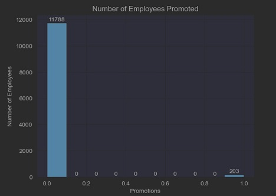

# Predicting Employee Churn For Salifort Motors

## Overview
Salifort Motors currently has a high turnover rate among employees and is concerned because they make a big investment in recruiting, training and upskilling it's employees.
Salifort Motors is seeking a method to use employee data to gauge what makes them leave the company and their reasons behind their departure. The method used to solve thier issue is a predictive model that can classify whether or not an employee will leave. For this task, I chose to build and evaluate two different models, a Logistic Regression Classifier and a Random Forest Classifier. I then compared the two based on their performace and transparency, to allow Salifort Motors to choose the best model for their needs. While the Logistic model exemplifies the most transparent model, the Random Forest Classifier performed the best. Here is a breakdown of how the two best tuned models performed:

| Metrics   | Logistic Regression | Random Forest |
|:----------|:--------------------|:--------------|
| Accuracy  | 87%                 |   99%         |
| Precision | 84%                 |   98%         |
| Recall    | 93%                 |   99%         |
| F1        | 88%                 |   99%         |
| AUC       | 87%                 |   99%         |

Based on the Random Forest model, satisfaction level, tenure, and the hours worked were the most influential features when determining if an employee was going to quit.

## Business Understanding

## Data Understanding
The dataset was provided by Salifort Motors and comprised of 14,999 self-reported employee surveys. The features included, satisfaction levels, evaluations, number of project contributions, average monthly hours worked, tenure at the company, work accidents, promotions, departments, salaries and if the employee left. After through analysis of the data, it was found that a number of these features had the potential influence behind an employee leaving. Many of these reasons included, evaluation scores, employees being over and under worked, employees take on too many projects than could be handled, and lack of promotions.
These reasons can be observed in the following charts.
* bar chart of employees that have left

 

* chart of employees that left based on hours
  

* chart of how long most employees are with company
  

* chart of hour many hours employees work a month
  

* chart of the number of projects employees contribute to compared to the number of hours they work
  

* chart of the lack of promotions
* 

  
## Model and Evaluation

## Conclusion
